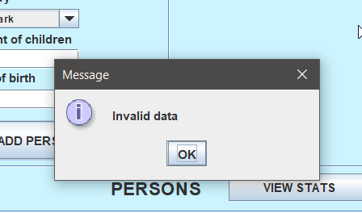

# Registry 

In this project we (Team Redmi 9A) managed to create a user-friendly Swing application that would allows us to create and register persons, with their 
respective personal data as well as their respective vehicules' data. 

## Team members:

- Giuliano Scognamiglio
- Alfonso Lopez
- Alvaro Ons
- Luciano Mosca

## Features!

#### USER FRIENDLY!
It's simple presentation makes it easy for the user to understand how it works.

At first glance the user will find the person's registry.

But when pressing "Next", the user will access to the vehicles' registry.

#### PERSONAL DETAILS!
Keeping up with the simplicity we wanted to give to this app, we decided to show personal data in a simple but clear way.

This is how we display the registered persons:

#### ADD EXTRA VEHICLES TO EXISTING PERSONS!

"OOPS! I FORGOT MY YATCH!" No problem, we can go back to the vehicles section, select the owner through the owner's comboBox and just add it.

#### BULLETPROOF!

With exception management and input restrictions we ensure it would be as hard as it could be for the user to insert invalid data or select invalid values when creating a person or a vehicle.

In order to prevent the user from messing up with the vehicles and their respective owners, we decided to disable the owner's selection comboBox when adding a vehicle until it gets saved.

#### ALWAYS UP TO DATE!

Every time the user registers a person or a vehicle, the stats on the "Stats" view will be updated.

#### EXTRAS!

The user can choose to only see people who got kids in the "Show Persons" view with a checkBox and change the background colour with the "Theme" comboBox!

As we can see, the person with the ID 7 is not shown since she/he doesn't have children.

Pink is cute.

## Pending features/objectives:

- Linking the app with a database in order to avoid losing all the registries when closing it.

